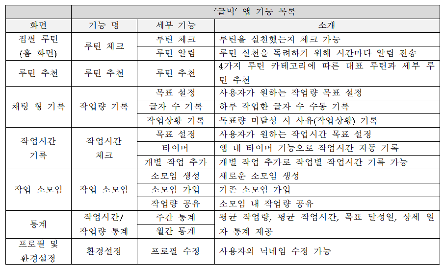
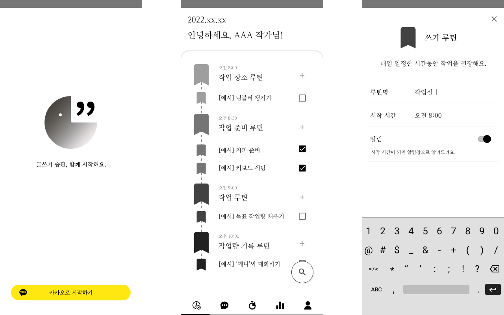
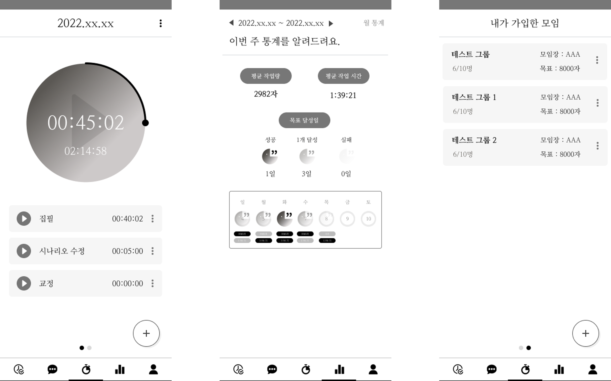
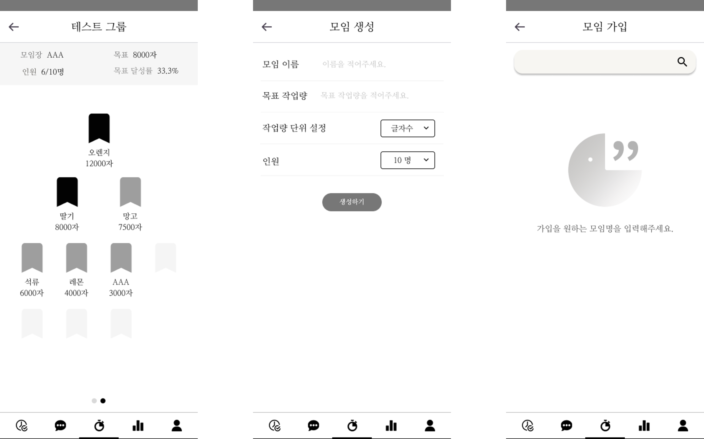

# Geulmeok
작가 양성을 위한 글쓰기 습관 형성 앱 ‘글먹’

## **개발 배경**
이 앱은 4가지 루틴(장소 루틴, 준비 루틴, 작업 시간 루틴, 작업량 루틴)을 바탕으로 글쓰기 습관을 형성한다면 꾸준한 글쓰기가 이뤄질 수 있다는 생각에서 시작했습니다.    
사용자는 '글먹' 앱을 이용하며 글쓰기 루틴을 만들고, 작업 시간을 측정하고, 다른 사람과 작업량을 비교하는 등의 일을 할 수 있습니다.

## **사용 기술**
  

## **기능 소개**

## **예상 결과 화면 (디자인)**

**14기 도전학기제 결과물입니다.**
